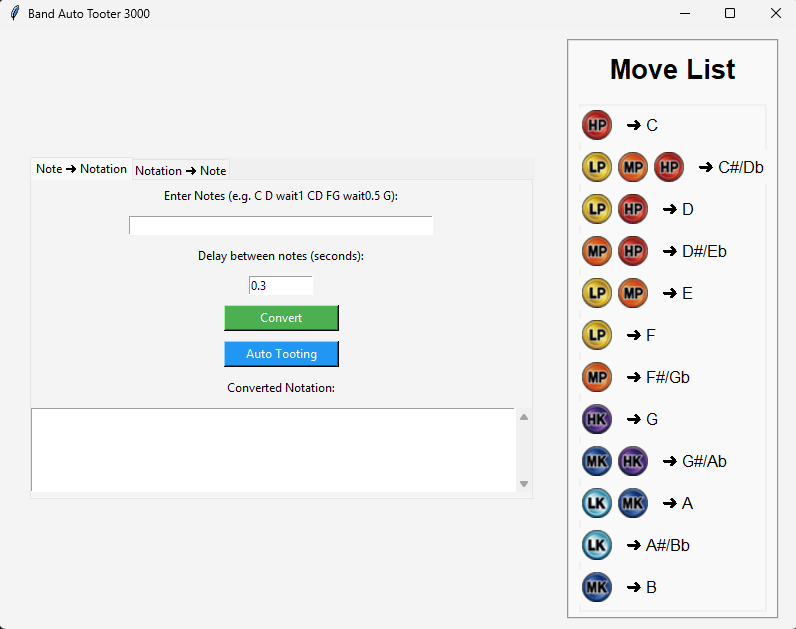
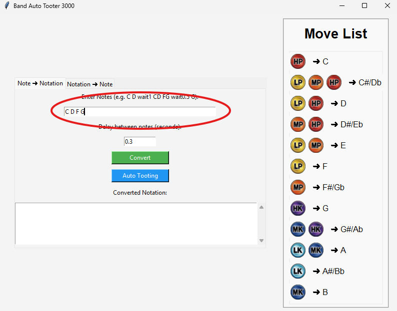
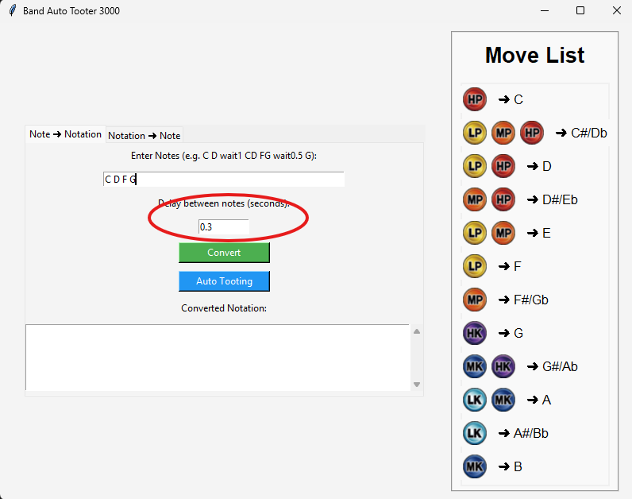
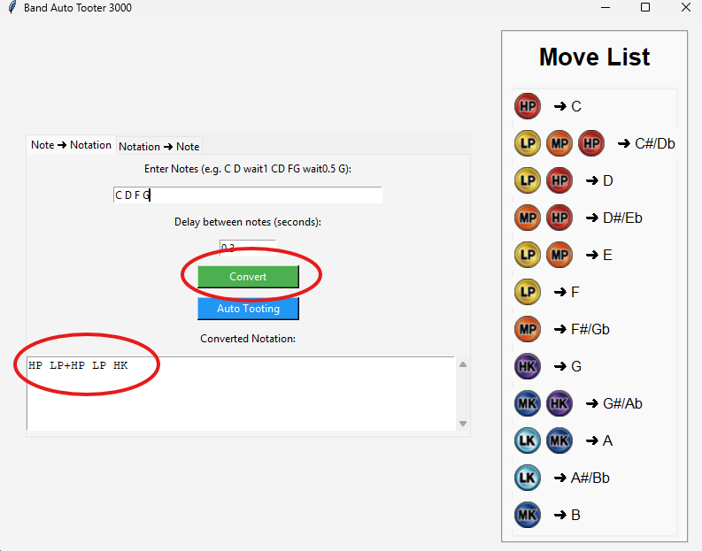
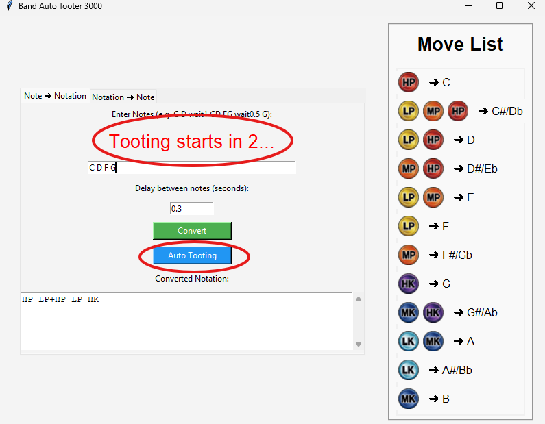
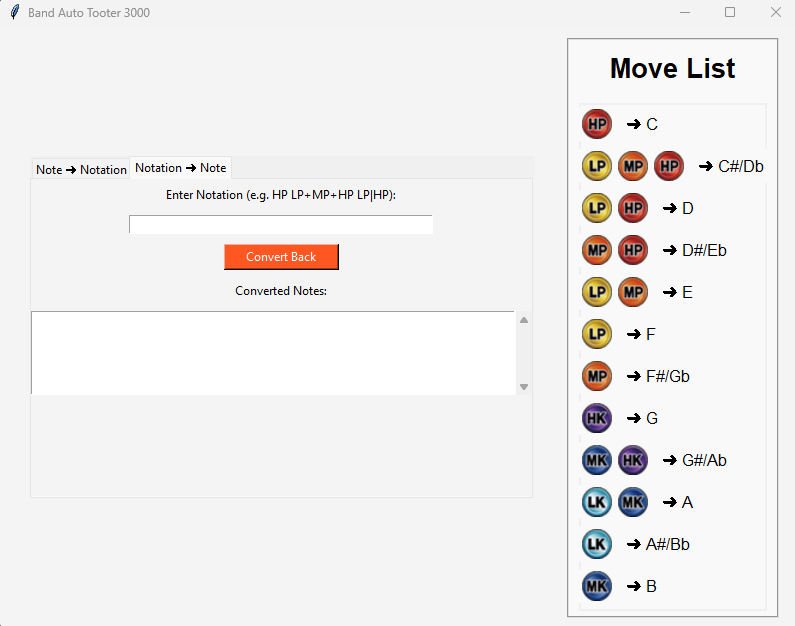
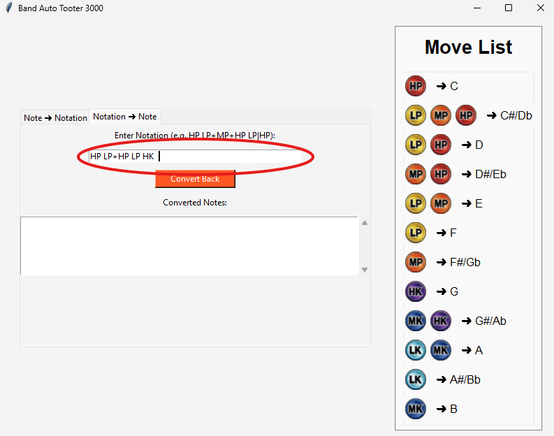
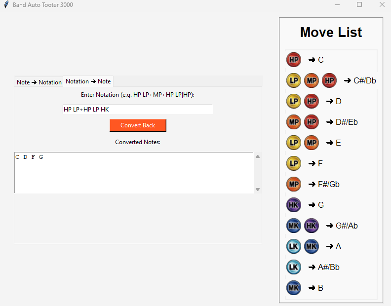

# 🎵 Band Auto Tooter 3000
Simple Python app that convert notes to notations, notations to notes, and auto TOOTING for Skullgirls 2n Encore Band.

[](https://opensource.org/licenses/MIT)


---

## 🧭 Navigation

- [Introduction](#-band-auto-tooter-3000)
- [Features](#-features)
- [App Structure](#-structure)
- [Prerequisites](#-prerequisites)
- [Default Keyboard Mapping](#-keyboard-mapping)
- [Example Input](#-example-input)
- [Demo](#-demo)

---

## ✨ Features

- 🎹 Convert standard musical notes (e.g., C, D#, A) into custom button notations (e.g., `HP`, `LP+HP`)
- 🔁 Reverse convert custom notations back to readable musical notes
- ⏱️ Add wait/delay commands (e.g., `wait1.5`) between sequences
- 🚀 Auto simulate typing the notation with keyboard inputs
- 🎨 Visual reference for key notations using icons
- 🖥️ Simple, intuitive GUI with two-way conversion and delay configuration

---

## 🧭 App Structure

The app has two tabs:

1. **Note ➜ Notation**
   - Input musical notes with optional `wait` commands
   - Convert and auto-type them with a specified delay

2. **Notation ➜ Note**
   - Input your custom notations (e.g., `HP LP+MP+HP`)
   - Get the musical note equivalent

A **right-side panel** displays a reference for all key mappings with icons.

---


## 🧰 Prerequisites

Before running or building the app, you need to have the following installed:

- Python 3.9+
- pip (Python package manager)
- The following Python modules:
  - `tkinter` (usually bundled with Python)
  - `Pillow`
  - `keyboard`

To install the necessary modules, run:

```bash
pip install pillow keyboard
```

--- 

## 🎮 Default Keyboard Mapping

| Notation | Keyboard Key | Description          |
|----------|---------------|----------------------|
|        | `u`           | Light Punch (F)      |
|        | `i`           | Medium Punch (F#/Gb) |
|        | `o`           | Heavy Punch (C)      |
|        | `j`           | Light Kick (A#/Bb)   |
|        | `k`           | Medium Kick (B)      |
|        | `l`           | Heavy Kick (G)       |
| IO                         | `space`       | Increase Octave (8)  |
| DO                         | `s`           | Decrease Octave (2)  |

---


## 📝 Example Input

You can enter musical notes or notation sequences like this:

```bash
# Notes to Notation
C D wait1 CD FG wait0.5 G

# Notation to Notes
HP LP+MP+HP LP|HP
```
---

## ✅ Demo

### Notes ➜ Notation


1. Input the notes in the notes bar.


2. Add delay/BPM for the notes.


3. Press **Convert** to convert notes to notations.


4. Press **Auto Tooting** to start auto tpying the notation in game.


### Notation ➜ Notes


1. Input the notation in the notation bar.


2. Press **Convert Back** to convert notation to notes.


---

# 🎉 Thank You and Happy Tooting! 🎉

